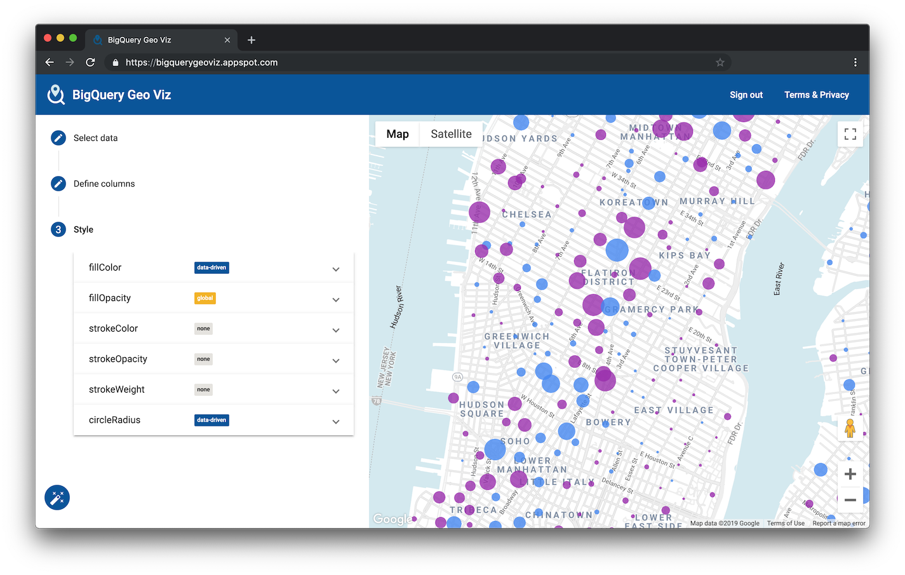

# BigQuery Geo Viz

Web tool and developer example for visualization of Google BigQuery geospatial data using Google Maps Platform APIs.



## Getting started

- Tool: https://bigquerygeoviz.appspot.com/
- Documentation: https://cloud.google.com/bigquery/docs/gis-analyst-start

## Development

### Quickstart

```shell
# Start a dev server at http://localhost:4200/.
npm run dev

# Run unit tests with Karma.
npm test
```

### Deploy to your dev project and version

This will run `npm run build`, copy the `app.yaml` into the `dist/` directory
and deploy the app from there at the specified project and version ID.

```shell
npm run deploy --project=my-project --app_version=my-version-id
```

Once deployed, the version will be available to test at the specified project
and version, e.g.:
https://my-version-id-dot-my-project.appspot.com

### Deploy to beta (for GeoViz maintainers)

```shell
npm run deploy:beta
```
Once deployed, the version will be available to test here:
https://beta-dot-bigquerygeoviz.appspot.com

### Deploy to a (prod) version (for GeoViz maintainers)

```shell
npm run deploy:prod --app_version=my-version-id
```

Once deployed, the version will be available to test at the specified version:
https://my-version-id-dot-bigquerygeoviz.appspot.com

To prevent accidentally pushing it live, the version will not be set as default.
To make it the default version, you will need to
[migrate it directly on the Cloud Console](https://cloud.google.com/appengine/docs/legacy/standard/python/migrating-traffic).

### Resources

- [Google Maps JavaScript API documentation](https://developers.google.com/maps/documentation/javascript/)
- [Google BigQuery REST API documentation](https://cloud.google.com/bigquery/docs/reference/rest/v2/)
- [Angular](https://angular.io/)
- [D3.js](https://d3js.org/)
- [TypeScript](https://www.typescriptlang.org/)

## Terms & privacy

This tool is provided as a reference implementation of Google Maps and geospatial BigQuery API usage capabilities. It may
be useful as a debugging and visualization resource. It is not an officially supported Google product and is provided without
guarantees of maintenance.

- [Google Terms of Service](https://policies.google.com/terms)
- [Google Cloud Platform Terms of Service](https://cloud.google.com/terms/)
- [Privacy](https://policies.google.com/privacy)
